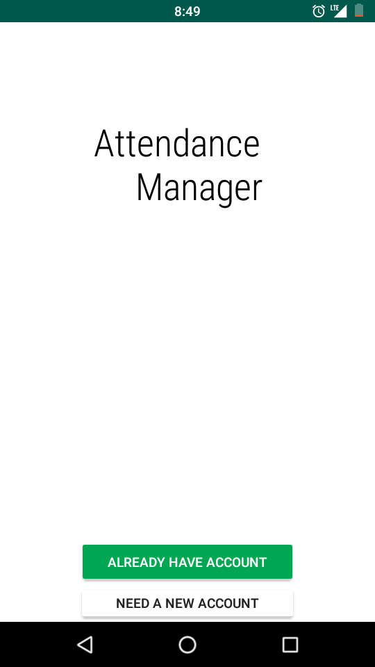
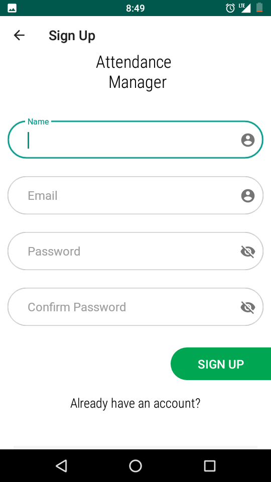
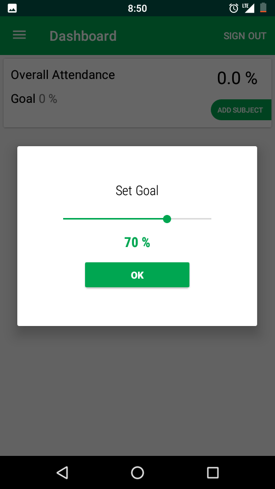
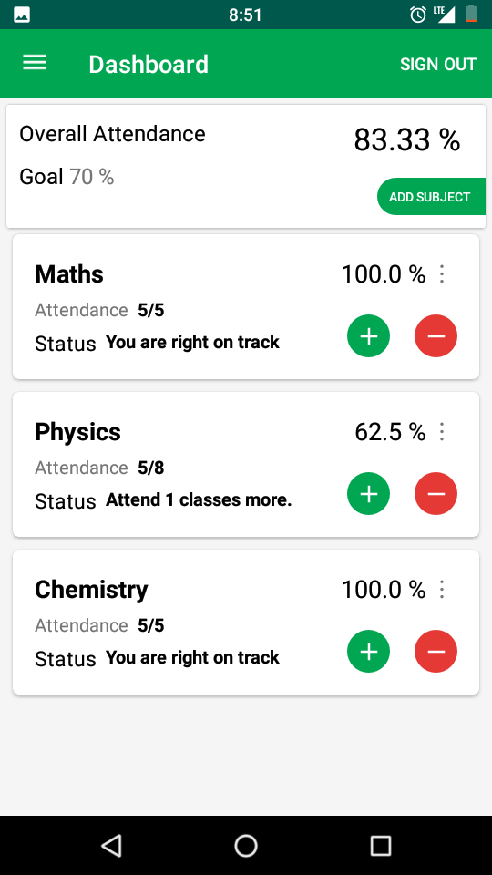

# Attendance Manager
Simple Attendance Manger where user can add / update / delete subject and increment / decrement attendance according to him/her.

## Technologies Used
  Java, Firebase, Android, Material UI

## Features
   * Add / Update / Delete subject. 
   * Increment / Decrement attendance.
   * User can set goal.
   * Automated system tell how much class needed if attendance is less than goal.
## Screenshots
<table>
<tr>
<td></td>
<td></td>
<td></td>
<td></td>
</tr>
</table>

## Limitation
      Work only on internet. Offline Capablities coming soon.
## Contributor
 * [Rajat](https://github.com/991rajat)
      
